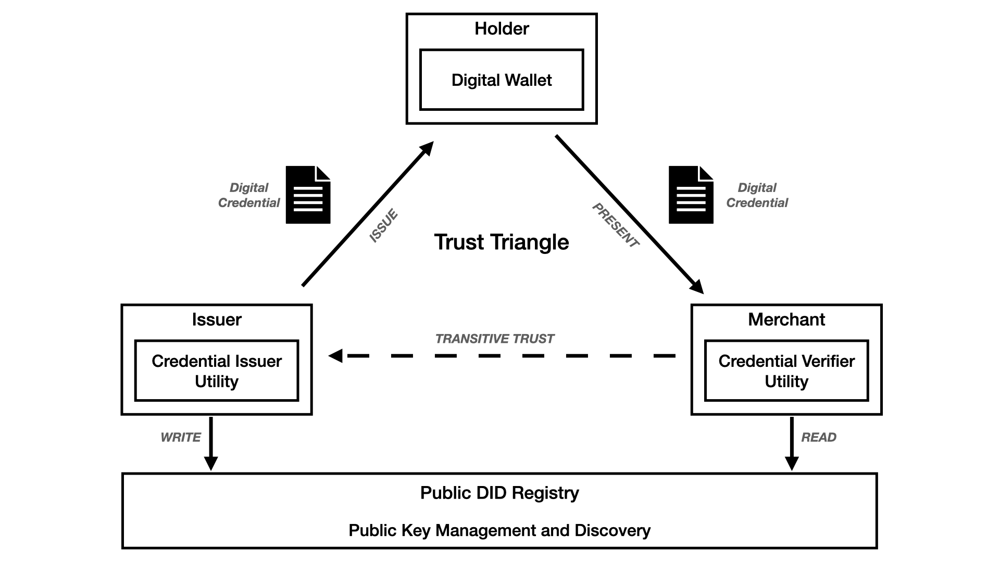

# Use Case Story Title

>NOTE: Update title and remove all Template Instructions.
 
#### Table of Contents
- [Use Case Story Title](#use-case-story-title) 
      - [Table of Contents](#table-of-contents)
  - [Acknowledgements](#acknowledgements)
  - [Business Challenge](#business-challenge)
    - [Concept](#concept)
    - [Approach](#approach)
  - [Vernacular](#vernacular)
  - [Assumptions](#assumptions)
  - [Persona](#persona)
  - [Story](#story)
  - [Demo Workflow](#demo-workflow)
    - [Step 1](#step-1)
    - [Step 2](#step-2)

 
## Acknowledgements

>Template Instructions: List any acknowledgements pertaining to the concepts and resources used in this use case story.
 
1. This scenario leverages a fictitious company called, _Acme Enterprise_. The  Acme Enterprise logo is borrowed from [Katie Wickens](https://steins_kake.artstation.com/projects/ebqgb), a graphics designer.
 
## Business Challenge
>Template Instructions: Briefly describe the business challenge address by this use case story.
 
### Concept
>Template Instructions: Briefly describe how this use case applies digit trust technology to the business challenge. 
 
### Approach
>Template Instructions: Describe the end to end interactions of the stakeholders in the trust triangle pertinent to this use case story.

 
## Vernacular

>Template Instructions: List and describe any terms that will be used in the story and referenced in the UML diagrams. The current list provides a a sample starter list. 
 
1. **Digital Wallet**: A financial transaction application that runs on multiple device modalities (mobile, computer). These applications store, manage, and present payment and identity instruments.
3. **Merchant**: An entity involved in e-commerce trade.
4. **Checkout Platform**: An e-Commerce Payment Platform (web application) used by merchants to manage the consumer experience and the end-to-end processing of e-commerce transactions.
5. **Credential Verifier Utility**: A merchant would augment their Checkout Platform with support by a vendor solution that allows consumers to: (a) consent to a digital authentication challenge; (b) present a digital credential for identity verification.
6. **Issuer**: A entity that makes assertions about information and delivers digital credentials containing attestations about those assertions.
7. **Credential Generator**: A software component used by the Issuer to manage the generation of new digital credentials.
8. **Credential Issuer Utility**: An Issuer would augment their Credential Generator with support by a vendor solution that allows Issuers to publish a digital credential to consumers.
9. **Public Registry**: A public utility that allows for the registration and discovery of Decentralized Identifiers (DIDs).
 
## Assumptions

>Template Instructions: List any assumptions to be considered in this use case story.
 
1. Use case assumes knowledge of the W3C Standards and open source software that supports the concepts outlined by the [Trust over IP Foundation](https://trustoverip.org/toip-model/).
2. Credential Issuer and Verifier Utility solutions are readily available from 3rd party vendors.
 
## Persona

>Template Instructions: Using the sample persona images in the /images folder, describe the roles of the entities involved in this use case story. The current list provides a a sample starter list. Refer to ./HELP.md#digital-trust-use-cases for example usage.
 
| Actor | Role | Goals | Details |
| --- | --- | --- | --- |
|  | Verifier |  |  |
|   Acme Enterprise | Issuer |  |  |
|  Angelica | Consumer |  |  |
 
## Story
>Template Instructions: Using the sample persona images in the /images folder, describe the steps that are involved in the interactive use case story. Refer to ./HELP.md#digital-trust-use-cases for example usage.
 
*  Acme Enterprise decided to issue a XYZ credential. 
 
## Demo Workflow

>Template Instructions: Using the sample persona images in the /images folder, describe the steps od the use case story as they relate to the UML diagram. Refer to ./HELP.md#digital-trust-use-cases for example usage. If desired, a single diagram can be used instead of multiple steps. 
 
### Step 1
 Acme Enterprise and  register their DIDs.
 

 
### Step 2
 
 challenges  Angelica for a credential.
 

 