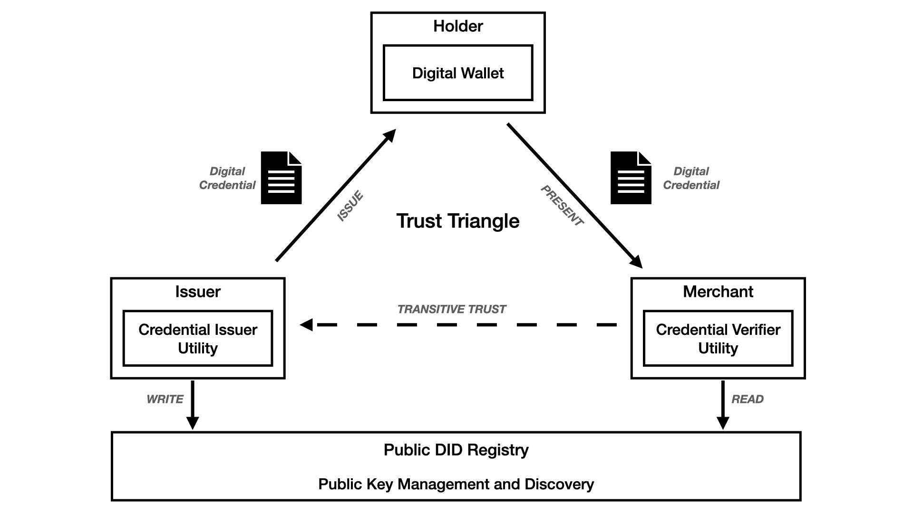

# Hack the Code

This directory is for the DFS Digital Identity Hackathon participants who are on the `Hack-the-code` track.

The trust triangle identifies three different personas:
1. Issuer
2. Verifier
3. Holder

Before writing any code, you will need your credential schema(s) and proof request(s) from your design thinking session.

To help you implement your use case, three samples are provided - one for each of the personas:

1. Issuer - [Sample issuer web application](issuer/README.md)
2. Verifier - [Sample verifier web application](verifier/README.md)
3. Holder - [Sample mobile application](mobile/README.md)

You will need to modify the issuer example with your credential schema, and modify the verifier example with your proof request.

---
**Note:**
The samples above may seem to imply that there will always be only one issuer and one verifier - but this is not true.  It is important for you to know that one or more of the following may be true for your use case.

* You may have multiple issuers.  For example, consider a use case in which a verifier requires some attributes from  a person's employment credential and other attributes from their driver's license.

* You may have multiple verifiers.  For example, consider a use case requiring multiple different types of verification and different places in an airport.

* You may have an entity which is both an issuer and a verifier.  For example, consider a use case in which a person's driver's license had to be verified before issuing them an employment credential.

* A single issuer may issue multiple types of credentials, each with a different schema.  For example, a single issuer might issue credentials for multiple types of employee badges.

All of these will be dependent upon your use case.