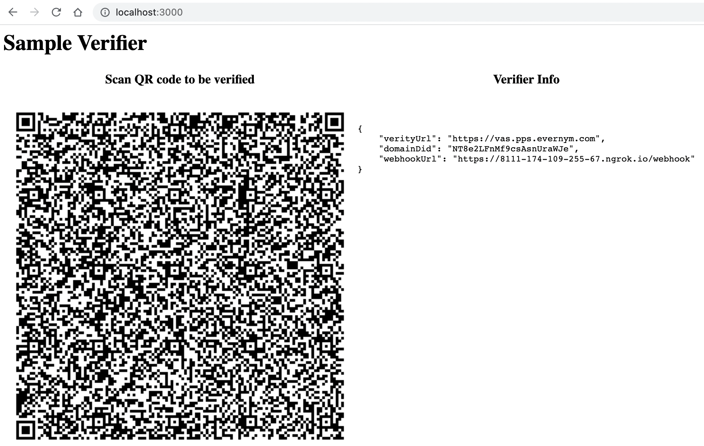
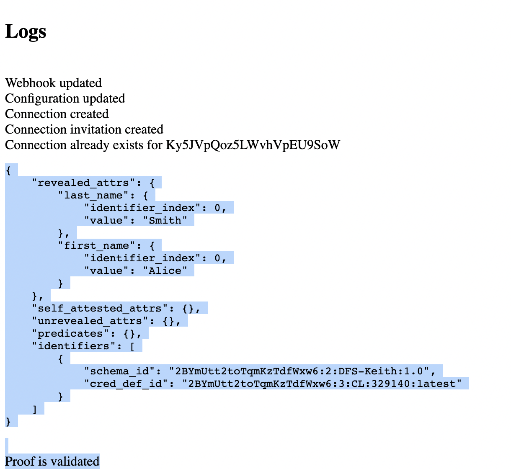

# Developing a Custom Verifier Web Application

This document describes how to build a custom verifier application which uses the [Verity REST APIs](https://gitlab.com/evernym/verity/verity-sdk#rest-api).

This directory contains a sample node-based verifier web application.  The simplest way to create a custom verifier web application is by customizing this sample node application, which is what the remainder of this document assumes.  If you choose to use another language (e.q. java, python, etc), you will need to translate the sample code to the language of your choice.

## Prereqs

Ensure that the following prereqs are met.

   - Install node.js v12 or later
   - Install ngrok ([https://ngrok.com/](https://ngrok.com/))
   - Install docker and docker-compose
   - Avast DOMAIN_DID and X_API_KEY

If you do not yet have a team DOMAIN_DID and X_API_KEY, send an email of the following form to natalia.moskaleva@avast.com:

   ```
   Subject: Request for DFS hackathon team DOMAIN_DID and X_API_KEY

   Team: <your team name>
   ```

Wait for Natalia to respond with your team's DOMAIN_DID and X_API_KEY values.
   
Your team only needs a single DOMAIN_DID and X_API_KEY, so if you already have these, you can skip this step.

## Gather information

This section describes the information you will need to gather in order to develop your custom verifier application.

1. Depending on your use case, you will need one or more credential definition IDs that were created by a [credential issuer](../issuer/README.md).  You will also need the names of the attributes associated with each credential definition ID which your verifier needs to verify.

   For example, if you want to verify that a person is 21 years or older according to your state's driver's license credential, you would need the credential definition ID of your state's DMV and the name of the attribute which provides the person's birthdate.

## Customizing the sample verifier code

The following are step-by-step instructions for how to customize the sample node-based verifier web application.

1. If you have not yet done so, fork this repository and clone the forked repository.  Set the `REPO_DIR` environment variable so that it refers to the `dfs-trucreds-hackathon` directory created by the clone operation.
   
   You should also have already followed the [hackathon configuration](../../../submission-guides/configuration-instructions.md) instructions and have a `$REPO_FOLDER/hackproject/code` directory that was copied from the htc track directory.

   ```
   $ cd $REPO_FOLDER
   $ mkdir ./hackproject/code
   $ cp -Rv ./track/htc/* ./hackproject/code/
   ```

2. Recursively copy the `$REPO_FOLDER/hackproject/code/verifier` directory to another directory for your issuer application and set the `APP_DIR` environment variable to refer to this newly created directory.

   For example, if your web application is supposed to verify that someone is a DFS employee credentials, you might copy the `$REPO_FOLDER/hackproject/code/verifier` directory to `$REPO_FOLDER/hackproject/code/verifier.dfsEmployee` as follows:

   ```
   cd $REPO_FOLDER
   cp -R hackproject/code/verifier hackproject/code/verifier.dfsEmployee
   export APP_DIR=$REPO_FOLDER/hackproject/code/verifier.dfsEmployee
   ```

3. Edit the file `$APP_DIR/code/.env` and set your `DOMAIN_DID` and `X_API_KEY` values appropriately as obtained from the [Gather information](#gather-information) section.

4. Edit the `$APP_DIR/code/src/main.js` file and set the `proofMessage` variable appropriately according to your use case (just below the `STEP 6.2 - Proof request` comment).  See information regarding how to form a valid proof message [here ](https://github.com/evernym/verity-sdk/blob/main/FAQ.md#proof-restrictions).  See [this swagger](https://app.swaggerhub.com/apis/evernym/verity-rest-api/1.0#/PresentProof/requestProof) for how to request a predicate (e.g. ">=" a numeric value).

   You may also need to further customize this application based on your use case.

## Building and running your verifier

You may build and run your verifier [via docker](#building-and-running-your-verifier-via-docker) or [natively](#building-and-running-your-verifier-natively).

### Building and running your verifier via docker

To build your verifier:

```
cd $APP_DIR
docker-compose build
```

To run your verifier:

```
docker-compose up -d
```

Your verifier should be available at `http://localhost:3000`.

To stop your verifier:

```
docker-compose stop
```

### Building and running your verifier natively

Prereqs:
   - You have NodeJs v12 installed
   - You have ngrok installed ([https://ngrok.com/](https://ngrok.com/))

To build:

```
cd $APP_DIR/code
npm install
```

To run:

1. In a separate terminal window start ngrok for port 3000 and leave it running :

   ```
   ngrok http 3000
   ```

2. Start your verifier web application as follows:

   ```
   cd $APP_DIR/code
   npm run start
   ```

   Your verifier web application should be available at `http://localhost:3000`.

## Testing your verifier with Connect.Me

If you are developing your own mobile application, you should test your verifier application with it.  This section describes how to test it with the Connect.Me mobile application.

With your verifier application running on your laptop, visit http://localhost:3000 in your browser.  You should see something similar to the following with a QR code.



Install the Connect.Me Digital Wallet mobile application on your iphone or android device.  It is available for free from the Apple AppStore Iphone and Google Play for Android.

Open the Connect.Me application, click the `Scan` button on the lower right part of the screen, and scan the QR code displayed by the Sample Verifier.  If prompted to accept a connection, accept it.  You should be asked to share attributes. Once you share them, you should then see additional logs similar to the following in your "http://localhost:3000" browser window just below the QR code that you scanned.



These logs display the values of the attributes which you shared from your mobile device as well as the result of the cryptographic verification.

You may now stop your verifier application on your laptop, and ngrok if running natively.