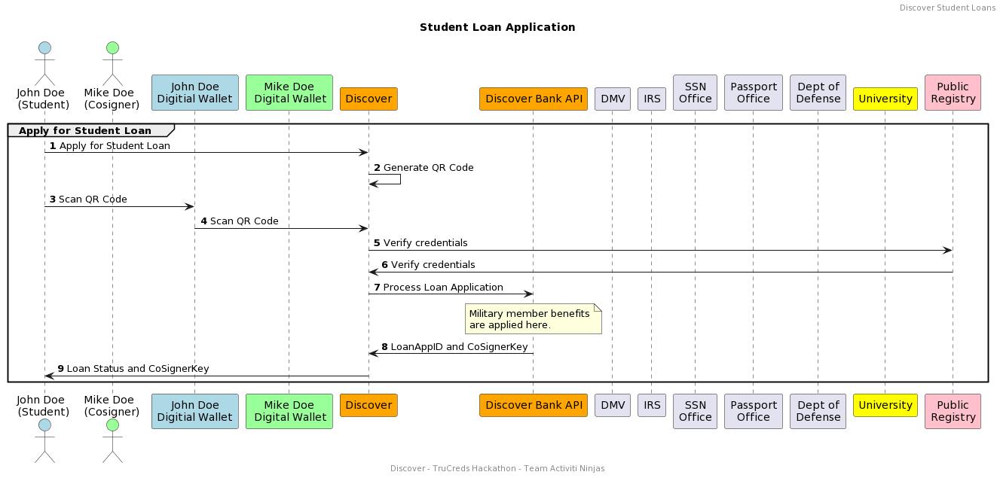

# Discover SmartDID Student Loans 

#### Table of Contents
- [Discover SmartDID Student Loans ](#discover-smartdid-student-loans )
  - [Table of Contents](#table-of-contents)
    - [Acknowledgements](#acknowledgements)
    - [Business Challenge](#business-challenge)
        - [Concept](#concept)
        - [Approach](#approach)
    - [Vernacular](#vernacular)
    - [Assumptions](#assumptions)
    - [Persona](#persona)
    - [Story](#story)
        - [Main Applicatant - Issuance](#todo)
        - [Co-Signer Issuance](#todo)
        - [Main Applicant - Loan Application Flow & Verification](#todo)
        - [Co-Signer - Flow](#todo)
        - [Main Applicant - Loan Approval and Issuance](#todo)
    - [Demo Workflow](#demo-workflow)
    - [Benefits](#benefits)
    - [Related Topics](#related-topics)


## Acknowledgements

1. Trucred Hackathon team for this opportunity and great planning.
2. Avast for their support.

## Business Challenge
Higher Education is a critical stage in one's life and securing the funds to pay for college is emotionally stressful.

The current student loan verification is long process requiring applicants submit many forms of verification document. 

Also, Student Loan fraud is increasing at rapid rate across the globe due to Identity Theft.

### Concept
By leveraging the cryptographically verifiable credentials of Digital Identity, financial institution like Discover can process student loans using the verifiable credentials in Digital Wallets.

This eliminates user providing the required data and Discover performing a verification activity on the data provided. 

Since the data in the digital wallet is provided by Trusted Issuer, Discover can trust the applicant and reduce the loans provided to unknown borrower.

### Approach
SmartDID Student Loan can be implemented using a standards based digital credential as described in the  [Verifiable Credential Trust Triangle](https://trustoverip.github.io/WP0010-toip-foundation-whitepaper/trust/vcred_trust_triangle/). Such a solution must demonstrate all phases of credential definition, credential
generation, credential transfer, wallet storage, and credential verification.

The goal is to demonstrate the end-to-end activities necessary to:

* Main Applicant/Co-Signer be issued credentials in the digital wallet.
* Discover is able to verify the credentials and process the loan application.
* Discover is able to verify the credentials of the co-signer
* Discover is able to apply promotions/offer/compliance based on Identity
* Discover is able to issue the student loan as digital credentials
* Main Applicant/Co-Signer is able to download the loan details as digital credentials into their wallet.

## Vernacular

1. **Digital Wallet**: A financial transaction application that runs on multiple device modalities (mobile, computer). These applications store, manage, and present payment and identity instruments.
0. **Verifier**: An entity involved in the verification of digital credentials.
1. **Issuer**: A entity that makes assertions about information and delivers digital credentials containing attestations about those assertions.
2. **Public Registry**: A public utility that allows for the registration and discovery of Decentralized Identifiers (DIDs).

## Assumptions

1. Use case assumes knowledge of the W3C Standards and Open -source software that supports the concepts outlined by the [Trust over IP Foundation](https://trustoverip.org/toip-model/).
2. Credential Issuer and Verifier Utility solutions are readily available from 3rd party vendors.


## Persona

| Actor                                                                        | Role | Goals                                                                                                                          | Details                                                                                                                                                             |
|------------------------------------------------------------------------------| --- |--------------------------------------------------------------------------------------------------------------------------------|---------------------------------------------------------------------------------------------------------------------------------------------------------------------|
|  <br> John Doe           | Main Applicant | Applies for Discover Student loan using the credentials in the digital wallet                                                  | Carries a mobile device with a digital wallet containing verifiable credentials from a variety of issuers.                                                          |
|  <br> Mike Doe           | Co-Signer | Co-Signs for a Discover Student loan using the credentials in the digital wallet.                                              | Carries a mobile device with a digital wallet containing verifiable credentials from a variety of issuers.                                                          |
|  <br>Discover   | Verifier | Ensure that all applicants of a SmartDID student loan meet business policy proof of identity, income, university and benefits. | Exploring use cases that would either eliminate the need to outsource student loan verification or reduce time/cost for doing student loan verification internally. |
|   <br>Discover  | Issuer | Upon verification of business policy requirements for student loan, issue a student loan credential.                           | Arm qualified consumers with a digital credential for use with SmartDID Student Loan offering.                                                                      |
|  <br>DMV                  | Issuer | Upon verification of business policy requirements for driving license, issue a driving license credential.                     | Arm qualified consumers with a digital credential for use with SmartDID Student Loan offering.                                             |
|  <br>SSN Office           | Issuer | Upon verification of business policy requirements for SSN, issue a SSN credential                                              | Arm qualified consumers with a digital credential for use with SmartDID Student Loan offering.                                             |
|  <br>Passport Office | Issuer | Upon verification of business policy requirements for passport, issue a passport credential.                                   | Arm qualified consumers with a digital credential for use with SmartDID Student Loan offering.                                             |
|  <br>IRS                  | Issuer | Upon verification of business policy requirements for tax filings, issue a IRS ID credential.                                  | Arm qualified consumers with a digital credential for use with SmartDID Student Loan offering.                                             |
|  <br>Dept of Defense      | Issuer | Upon verification of business policy requirements for defense duty, issue a defense id credential.                             | Arm qualified consumers with a digital credential for use with SmartDID Student Loan offering.                                             |
|  <br>DTA University      | Issuer | Upon verification of business policy requirements for college enrollment, issue a digital college enrollment credential.       | Arm qualified consumers with a digital credential for use with SmartDID Student Loan offering.                                             |

## Story

### Ecosystem Setup
* All issuers register their DID in a public registry.
* All issuers define the schema, credential definition in the public registry.
*    Mike Doe/John Doe visits the trusted issuers website and requests for digital credentials.
* Issuer website displays a QR Code and instructional text “Scan Request with your Digital Wallet App”.
*     Mike Doe/John Doe opens the ```Connect.Me``` App on her device and scans the QR code.
* The ```Connect.me``` App prompts   Mike Doe/John Doe with the message: "{Issuer} is offering the following secure credentials, do you accept?”
*    Mike Doe/John Doe initiates the process to accept the secure credential.
* Credential is sent to    Mike Doe's/John Doe's device and protected with the secure element of the device.

### Student Loan Application
*  John Doe, visits Discover Student  website and initiates a student loan application process. 
* The  website displays a QR code and instructional text “Scan to submit your loan application with your Digital Wallet App”.
*  John Doe opens the ```Connect.Me``` App on her device and scans the QR code.
* The ```Connect.me``` App prompts  John Doe with the message: " is requesting the following secure credentials, do you accept?”
*  John Doe initiates the process to accept the proof request.
* Proof response is sent to  Discover.
* Discover  verifies the proof and applies military member benefits to the loan application
* Discover  generates loan ID and CoSigner Key
* Discover  updates John Doe with loan status and requests for co-signer.

### Co-Sign an existing Loan Application <todo>
*  Angelica, an  Acme Enterprise employee, signs in to the employee HR portal provided by  Workday.
*  Angelica sees a new feature to *Generate Secure Credential(s)*.
* The  Workday system presents the credential options. The data in this credential schema minimally addresses the proof of employment requirements needed to use password-less authentication with .
*  Angelica selects one or more credentials and clicks OK.
* The  Workday software generates a QR code and instructional text “Scan Credentials with your Digital Wallet App”.
*  Angelica opens her  Avast digital wallet, ```Connect.me```, and scans the QR code.
* The ```Connect.me``` App prompts  Angelica with the messsage: “Workday is offering the following secure credentials, do you accept?”
*  Angelica initiates the process to accept the offer of secure credentials.
* Credentials are sent to  Angelica's device and protected with the secure element of the device.

### Download the Student Loan Credentials <todo>
* Some time passes, and  Angelica desires to register for password-less access to her account with .
*  Angelica visits  website and initiates the “Registration” flow.
* The  website displays the page requesting the employee’s information, and a new Icon "Register Account using Digital Wallet”.
*  Angelica clicks the Wallet icon.
* The  website displays a QR code and instructional text “Scan Request with your Digital Wallet App”.
*  Angelica opens the ```Connect.Me``` App on her device and scans the QR code.
* The ```Connect.me``` App prompts  Angelica with the message: " is requesting proof of employment and government ID. Do you accept?”
*  Angelica accepts the credential request.
* Using the ```Connect.me``` App,  Angelica selects the credentials in her wallet that will be used to respond to the request.
* Credentials are securely transferred to and verified by .
* The ```Connect.me``` App prompts  Angelica with the message:  is offering the following secure credentials, do you accept?”
*  Angelica initiates the process to accept the offer of the secure credential.
* Credential is sent to  Angelica's device and protected with the secure element of the device.

## Demo Workflow




## Benefits
1. Consumer: Simple, consistent authentication across all DFS accounts and modalities.
2. Discover: Shared recognition between DFS Systems and Agents regarding the degree of KYC processing already done.
## Related Topics

* How can aspects of this use case be used to improve / advance our existing KYC process?
* Could DFS benefit from the concepts depicted in the [Digital Notary](https://github.com/hyperledger/aries-rfcs/blob/main/features/0116-evidence-exchange/digital_notary_usecase.md) use case outlined by the [evidence protocol for KYC processing](https://github.com/hyperledger/aries-rfcs/tree/main/features/0116-evidence-exchange)?
