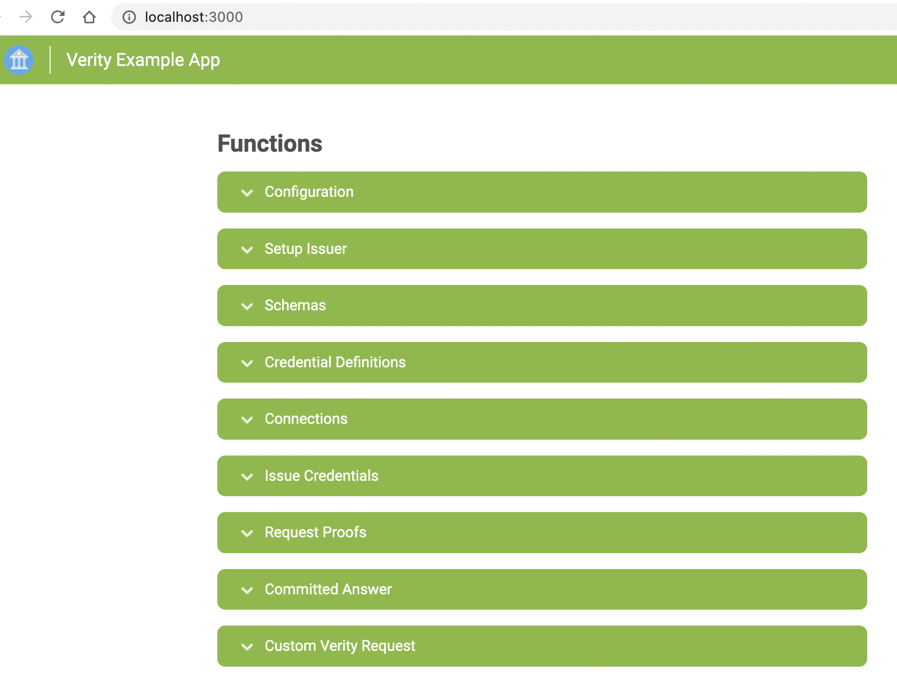
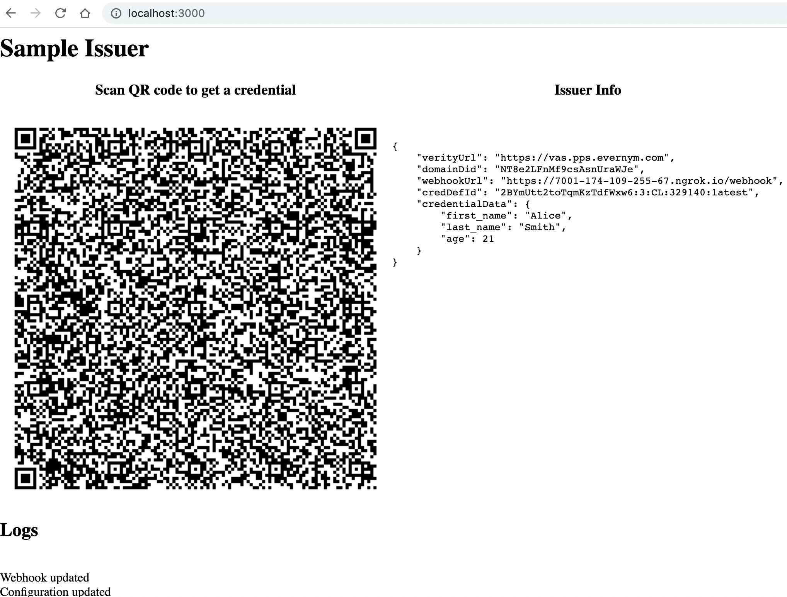

# Developing a Custom Issuer Web Application

This document describes how to build a custom issuer application which uses the [Verity REST APIs](https://gitlab.com/evernym/verity/verity-sdk#rest-api).

This directory contains a sample node-based issuer web application.  The simplest way to create a custom issuer web application is by customizing this sample node application, which is what the remainder of this document assumes.  If you choose to use another language (e.g. java, python, etc), you will need to translate the sample code to the language of your choice.

## Prereqs

Ensure that the following prereqs are met.

   - Install node.js v12 or later
   - Install ngrok ([https://ngrok.com/](https://ngrok.com/))
   - Install docker and docker-compose
   - Avast DOMAIN_DID and X_API_KEY

If you do not yet have a team DOMAIN_DID and X_API_KEY, send an email of the following form to natalia.moskaleva@avast.com:

   ```
   Subject: Request for DFS hackathon team DOMAIN_DID and X_API_KEY

   Team: <your team name>
   ```

Wait for Natalia to respond with your team's DOMAIN_DID and X_API_KEY values.
   
Your team only needs a single DOMAIN_DID and X_API_KEY, so if you already have these, you can skip this step.


## Gather information

There are several pieces of information which you will need to get in order to write your custom issuer web application.  

**Note:** This section only needs to be done once to create your credential schema(s) and credential definition ids for your use case.

1. Start ngrok as follows in a separate terminal window and leave it running:

   ```
   ngrok http 3000
   ```

   Note that `WEBHOOK_URL` in the next step refers to your NGROK forwarding URL of the form `https://<uuid>.ngrok.io`.

2. Clone the Verity SDK and build/run the sample Verity web application as follows:

    ```
    git clone https://gitlab.com/evernym/verity/verity-sdk.git
    cd verity-sdk/samples/rest-api/web-app
    npm install
    export VERITY_URL=https://vas.pps.evernym.com
    export DOMAIN_DID=<YOUR DOMAIN_DID FROM STEP 1>
    export X_API_KEY=<YOUR X_API_KEY FROM STEP 1>
    export WEBHOOK_URL=<YOUR WEBHOOK_URL FROM STEP 2>
    node app.js
    ```

3. Visit http://localhost:3000 in your browser.  You should see a screen similar to the following:

   

   a. Expand `Configuration` and click the `Update configuration on VAS` button.

   b. Expand `Setup Issuer` and click the `Setup Issuer` button.  Copy the `Issuer DID` and `Issuer VerKey` values.  If Natalia did not already indicate in her previous response that these values have been endorsed, send another email to her or respond to her previous response, including the `Issuer DID` and `Issuer VerKey` values and requesting that they be endorsed before proceeding.

   c. Expand `Schemas` and fill in values for the following fields:
      
      * Schema Name
        
        This name must be unique on the ledger; therefore, we recommend that you use a name of the form: DFS-hackathon-*shortTeamName*-*suffix* (e.g. `DFS-hackathon-team1-employee`).

      * Schema Version

        Typically a value of the form `1.0`.

      * Attribute Names

        One or more attribute names (e.g. "first_name", "last_name", "age").

        Make sure you remember these attribute names, because you will need them later.
       
      Click the `Write Schema` button and make a note of the  `Schema Id` value to be used in the next step.

    d. Expand `Credential Definitions` and fill in the following fields:

      * Credential Definition Name

        This can be any name that you want.  It is only used locally.

      * Schema ID

        This must be the value of the `Schema Id` from the previous step.

      Click the `Write Credential Definition` and set the `CREDENTIAL_DEFINITION_ID` environment variable to the value displayed as the `Credential Definition Id`.

	e. Repeat steps (c) & (d) for each schema your use case needs.

4. Stop ngrok that was started in step 1 and the Verity sample web application which was started in step 2.

Write down the `Schema Ids` and corresponding `CREDENTIAL_DEFINITION_IDs` that were created as they will be used in the next section.  For our example, they are

|Schema Name|Schema Version|Schema Id|Attributes|CREDENTIAL_DEFINITION_ID|
|---|---|---|---|---|
|DFS-hackathon-team1-employee|1.0|Aa4...UVk:2:DFS-hackathon-team1-employee:1.0|"first_name", "last_name", "age"|Aa4...UVk:3:CL:325441:latest|

## Customizing the sample issuer code

The following are step-by-step instructions for how to customize the sample node-based issuer web application.

1. If you have not yet done so, fork this repository and clone the forked repository.  Set the `REPO_FOLDER` environment variable so that it refers to the `dfs-trucreds-hackathon` directory created by the clone operation.  
   
   You should also have already followed the [hackathon configuration](../../../submission-guides/configuration-instructions.md) instructions and have a `$REPO_FOLDER/hackproject/code` directory that was copied from the htc track directory.

   ```
   $ cd $REPO_FOLDER
   $ mkdir ./hackproject/code
   $ cp -Rv ./track/htc/* ./hackproject/code/
   ```

2. Recursively copy the `$REPO_FOLDER/hackproject/code/issuer` directory to another directory for your issuer application and set the `APP_DIR` environment variable to refer to this newly created directory.

   For example, if your web application is supposed to issue DFS employee credentials, you might copy the `$REPO_FOLDER/hackproject/code/issuer` directory to `$REPO_FOLDER/hackproject/code/issuer.dfsEmployeeCredentials` as follows:

   ```
   cd $REPO_FOLDER
   cp -R hackproject/code/issuer hackproject/code/issuer.dfsEmployeeCredentials
   export APP_DIR=$REPO_FOLDER/hackproject/code/issuer.dfsEmployeeCredentials
   ```

3. Edit the file `$APP_DIR/code/.env` and set your `DOMAIN_DID`, `X_API_KEY`, and `CREDENTIAL_DEFINITION_ID` values appropriately as obtained from the [Gather information](#gather-information) section.

4. Edit the `$APP_DIR/code/src/main.js` file and set the `credentialData` variable with the appropriate attribute names and values.  For example, it might look as follows:

   ```
   // Credential data
   const credentialData = {
      "first_name": "Alice",
      "last_name": "Smith",
      "age": "22"
   };
   ```

   Note that this sample application always issues the same attribute names and values.  This would obviously not be the case for a real world application since the values would differ depending on who is requesting the credential.  However, depending on your use case, it may be sufficient to assume that a single user (e.g. "Alice") has already been authenticated and always issue that user's credential.  Or you may choose to make your application more real-world by supporting issuance of credentials for multiple users.
   
   You will also likely want to further customize this application based on your use case.

## Building and running your issuer

You may build and run your issuer [via docker](#building-and-running-your-issuer-via-docker) or [natively](#building-and-running-your-issuer-natively).

### Building and running your issuer via docker

To build your issuer:

```
cd $APP_DIR
docker-compose build
```

To run your issuer:

```
docker-compose up -d
```

Your issuer should be available at `http://localhost:3000`.

To stop your issuer:

```
docker-compose stop
```

### Building and running your issuer natively

Prereqs:
   - You have NodeJs v12 installed
   - You have ngrok installed ([https://ngrok.com/](https://ngrok.com/))

> **NOTE**: The issuer application webhook endpoint (**/webhook**) needs to be served on a public URL so that Verity Application server can send messages to it. **Ngrok** is used here as a developer tool to provide a publicly available endpoint that tunnels to the local listening port of the Issuer App. If you have capabilities to start the Issuer application on a cloud infrastructure then you don't need to install and start ngrok - you just need to specify your URL address in the **webhookUrl** parameter (e.g. `http://<your_cloud_ip>:3000/webhook`)

To build:

```
cd $APP_DIR/code
npm install
```

To run:

1. In a separate terminal window start ngrok for port 3000 and leave it running :

   ```
   ngrok http 3000
   ```

2. Start your issuer web application as follows:

   ```
   cd $APP_DIR/code
   npm run start
   ```

   Your issuer web application should be available at `http://localhost:3000`.

## Testing your issuer with Connect.Me

If you are developing your own mobile application, you should test your issuer application with it.  This section describes how to test it with the Connect.Me mobile application.

With your issuer application running on your laptop, visit http://localhost:3000 in your browser.  You should see something similar to the following with a QR code.



Install the Connect.Me Digital Wallet mobile application on your iphone or android device.  It is available for free from the Apple AppStore Iphone and Google Play for Android.

Open the Connect.Me mobile application, click the `Scan` button on the lower right part of the screen, and scan the QR code displayed by the Sample Issuer.  Accept the connection offer and the credential offer on your mobile device.

To see your connections in your Connect.Me mobile application, click the hamburger on the top left and select `My Connections`.
You should have a connection to the issuer application.

To see your credentials in your Connect.Me mobile application, click the hamburger on the top left and select `My Credentials`.  You should have a credential from the issuer application.

You may now stop your issuer application on your laptop.